# 👁️ GodView v0.6.0

## The HTTP of Spatial Computing

[](https://opensource.org/licenses/MIT)
[](https://www.rust-lang.org/)
[](#-test-results)
[](godview_sim/README.md)
[](https://rerun.io/)
[](#)

> *A Self-Evolving Distributed Perception Protocol for Multi-Agent Autonomous Systems*

**GodView** solves the fundamental problems of distributed spatial computing: time synchronization across networks, 3D spatial indexing at global scale, and Byzantine fault tolerance in untrusted agent meshes.

---

## 🏗️ Architecture

```mermaid
graph TB
    subgraph "godview_core"
        TIME["⏰ Time Engine<br/>godview_time.rs<br/><i>AS-EKF</i>"]
        SPACE["🌍 Space Engine<br/>godview_space.rs<br/><i>H3 + 3D Grid</i>"]
        TRUST["🔐 Trust Engine<br/>godview_trust.rs<br/><i>CapBAC + Ed25519</i>"]
        TRACK["🎯 Tracking Engine<br/>godview_tracking.rs<br/><i>GNN + CI + Highlander</i>"]
    end
    
    ZENOH["Zenoh Mesh"] --> TRUST
    TRUST --> TRACK
    TRACK --> TIME
    TRACK --> SPACE
```



| Problem | Engine | Solution |
|:--------|:-------|:---------|
| **Time Travel** — Out-of-sequence measurements | Time | Augmented State EKF with retrodiction |
| **Pancake World** — 2D spatial indices ignore altitude | Space | H3 hexagonal sharding + 3D grid spatial index |
| **Sybil Attack** — Unauthenticated publishers | Trust | CapBAC with Biscuit tokens + Ed25519 signatures |
| **Duplicate Ghost** — Same object, multiple IDs | Tracking | GNN + Covariance Intersection + Highlander CRDT |

---

## ⏰ Time Engine: Augmented State EKF

**File:** [`godview_core/src/godview_time.rs`](godview_core/src/godview_time.rs)

The Time Engine handles **Out-of-Sequence Measurements (OOSM)** — a critical problem in distributed systems where sensor data arrives with 100-500ms network latency.

### How It Works

Instead of rewinding time, the AS-EKF maintains a sliding window of **L past states**:

```
Augmented State:   x̂_aug = [x̂_k, x̂_{k-1}, ..., x̂_{k-L}]ᵀ

Augmented Covariance (tracks correlations between current and past states):
                   ┌ P_{k,k}    P_{k,k-1}   ... P_{k,k-L}  ┐
         P_aug =   │ P_{k-1,k}  P_{k-1,k-1} ... P_{k-1,k-L}│
                   │ ...        ...         ... ...        │
                   └ P_{k-L,k}  P_{k-L,k-1} ... P_{k-L,k-L}┘
```

**Configuration:** `L=20` at 30Hz provides a **600ms rewinding window**.

### Critical Algorithm: State Augmentation

When time advances, states shift into history **and** the covariance matrix shifts correspondingly:

```rust
fn augment_state(&mut self, current_time: f64) {
    let s = self.state_dim;
    
    // 1. Shift state blocks (index N → N+1, etc.)
    for i in (1..=self.max_lag_depth).rev() {
        let src = (i - 1) * s;
        let dst = i * s;
        let block = self.state_vector.rows(src, s).clone_owned();
        self.state_vector.rows_mut(dst, s).copy_from(&block);
    }
    
    // 2. CRITICAL: Also shift covariance matrix blocks
    for i in (1..=self.max_lag_depth).rev() {
        for j in (1..=self.max_lag_depth).rev() {
            let block = self.covariance
                .view(((i-1)*s, (j-1)*s), (s, s))
                .clone_owned();
            self.covariance
                .view_mut((i*s, j*s), (s, s))
                .copy_from(&block);
        }
    }
}
```

### Joseph-Form Update (Numerical Stability)

```rust
let IKH = &I - &K * &H_aug;
self.covariance = &IKH * &self.covariance * IKH.transpose()
    + &K * &self.measurement_noise * K.transpose();
```

---

## 🌍 Space Engine: H3 + 3D Grid

**File:** [`godview_core/src/godview_space.rs`](godview_core/src/godview_space.rs)

The Space Engine solves the **"Pancake World"** problem — standard 2D geospatial indexes ignore altitude, causing drones at 300m to appear co-located with ground vehicles.

### Two-Level Hierarchy

```
                    ┌─────────────────────────────────────┐
                    │         Global (Spherical)           │
                    │    H3 Hexagonal Grid (Res 10)       │
                    │         ~66m per hexagon            │
                    └─────────────┬───────────────────────┘
                                  │
                    ┌─────────────▼───────────────────────┐
                    │        Local (3D Cartesian)         │
                    │     3D Hash Grid (10m cells)        │
                    │      O(k³) spherical queries        │
                    └─────────────────────────────────────┘
```

### 3D Grid Spatial Index

```rust
#[derive(Hash, Eq, PartialEq)]
struct GridCell {
    x: i32,
    y: i32,
    z: i32,
}

impl GridCell {
    fn from_local_coords(coords: [f32; 3], cell_size: f32) -> Self {
        Self {
            x: (coords[0] / cell_size).floor() as i32,
            y: (coords[1] / cell_size).floor() as i32,
            z: (coords[2] / cell_size).floor() as i32,
        }
    }
}
```

### Efficient Sphere Query (O(k³) vs O(N))

```rust
pub fn query_sphere(&self, center: [f32; 3], radius: f32) -> Vec<&Entity> {
    let cell_radius = (radius / self.grid_cell_size).ceil() as i32;
    let center_cell = GridCell::from_local_coords(center, self.grid_cell_size);
    
    let mut results = Vec::new();
    
    // Only check cells within radius (O(k³) vs O(N) linear scan)
    for grid_cell in center_cell.neighbors(cell_radius) {
        if let Some(entity_ids) = self.spatial_grid.get(&grid_cell) {
            for &id in entity_ids {
                if distance(&entity, center) <= radius {
                    results.push(entity);
                }
            }
        }
    }
    results
}
```

### H3 Resolution Lookup

```rust
const H3_EDGE_LENGTH_M: [f64; 16] = [
    1107712.591,  // Res 0
    // ...
    65.907,       // Res 10 - ~66m (default)
    24.910,       // Res 11 - ~25m
    // ...
];
```

---

## 🔐 Trust Engine: CapBAC + Ed25519

**File:** [`godview_core/src/godview_trust.rs`](godview_core/src/godview_trust.rs)

The Trust Engine prevents **Sybil attacks** and data spoofing using cryptographic provenance and capability-based access control.

### The Security Chain

1. **Provenance:** Every hazard packet is signed by the agent's private Ed25519 key
   - Prevents spoofing (can't fake being Agent #42)

2. **Authorization:** Agent presents a Biscuit token signed by Root Authority
   - Token: `allow if resource("godview/nyc/sector_7")`

3. **Datalog Policies:** Rules are evaluated logically
   - If Agent #42 tries to publish to `godview/sf/sector_1`, policy fails (token restricted to NYC)

### Signed Packet Structure

```rust
pub struct SignedPacket {
    payload: Vec<u8>,
    
    #[serde(with = "signature_serde")]
    signature: Signature,
    
    #[serde(with = "verifying_key_serde")]
    public_key: VerifyingKey,
}

impl SignedPacket {
    pub fn verify_integrity(&self) -> Result<(), AuthError> {
        self.public_key
            .verify(&self.payload, &self.signature)
            .map_err(|_| AuthError::InvalidSignature)
    }
}
```

### O(1) Revocation Check

```rust
pub struct SecurityContext {
    root_public_key: PublicKey,
    revoked_keys: HashSet<[u8; 32]>,  // O(1) lookup (was Vec with O(N))
}

impl SecurityContext {
    pub fn is_revoked(&self, key: &VerifyingKey) -> bool {
        self.revoked_keys.contains(&key.to_bytes())  // O(1)
    }
}
```

---

## 🎯 Tracking Engine: GNN + CI + Highlander

**File:** [`godview_core/src/godview_tracking.rs`](godview_core/src/godview_tracking.rs)

The Tracking Engine eliminates **duplicate ghosts** when multiple agents observe the same physical entity.

### 4-Stage Pipeline

```
┌──────────────┐    ┌──────────────┐    ┌──────────────┐    ┌──────────┐
│   STAGE 1    │───▶│   STAGE 2    │───▶│   STAGE 3    │───▶│  STAGE 4 │
│   Spatial    │    │   Geometric  │    │   Identity   │    │   State  │
│   Pruning    │    │    Gating    │    │  Resolution  │    │  Fusion  │
└──────────────┘    └──────────────┘    └──────────────┘    └──────────┘
       │                   │                   │                   │
       ▼                   ▼                   ▼                   ▼
  H3 k-ring(1)        Mahalanobis         Highlander           Covariance
   → ~7 cells          Distance           Min-UUID             Intersection
```

### Stage 2: Mahalanobis Gating

```rust
pub fn mahalanobis_distance_squared(
    &self,
    track: &UniqueTrack,
    packet: &GlobalHazardPacket,
) -> f64 {
    let h = Matrix6::identity();
    let z = Vector6::new(
        packet.position[0], packet.position[1], packet.position[2],
        packet.velocity[0], packet.velocity[1], packet.velocity[2],
    );
    
    let residual = z - &h * &track.state;
    let r = self.confidence_to_covariance(packet.confidence_score);
    let s = &h * &track.covariance * h.transpose() + r;
    
    let s_inv = s.try_inverse().unwrap_or(Matrix6::identity() * 1e6);
    (residual.transpose() * s_inv * residual)[(0, 0)]
}
```

**Threshold:** D² < 12.59 (Chi² distribution, 6 DOF, 95% confidence)

### Stage 3: Highlander ID Resolution (Min-UUID CRDT)

> *"There can be only one."*

```rust
impl UniqueTrack {
    pub fn merge_id(&mut self, remote_id: Uuid) {
        // G-Set: Only grows, never shrinks
        self.observed_ids.insert(remote_id);
        
        // Highlander: smallest UUID wins
        if remote_id < self.canonical_id {
            self.canonical_id = remote_id;
        }
    }
}
```

All agents converge to the same canonical_id without coordination.

### Stage 4: Covariance Intersection (Loop-Safe Fusion)

```rust
pub fn covariance_intersection(
    x_a: &Vector6<f64>, p_a: &Matrix6<f64>,
    x_b: &Vector6<f64>, p_b: &Matrix6<f64>,
) -> Option<(Vector6<f64>, Matrix6<f64>)> {
    // Weight using trace minimization
    let tr_a = p_a.trace();
    let tr_b = p_b.trace();
    let omega = tr_b / (tr_a + tr_b);
    
    let p_a_inv = p_a.try_inverse()?;
    let p_b_inv = p_b.try_inverse()?;
    
    let p_ci_inv = p_a_inv * omega + p_b_inv * (1.0 - omega);
    let p_ci = p_ci_inv.try_inverse()?;
    
    let x_ci = p_ci * (p_a_inv * x_a * omega + p_b_inv * x_b * (1.0 - omega));
    
    Some((x_ci, p_ci))
}
```

**Why CI?** In gossip networks, data recirculates. CI is **loop-safe** — it never reduces uncertainty below the most confident input.

---

## ✅ Test Results

```bash
$ cargo test --lib
running 37 tests
test result: ok. 37 passed; 0 failed
```

### Running Tests

```bash
cd godview_core

# Run all library tests
cargo test --lib

# Run specific module
cargo test godview_time
cargo test godview_tracking

# Run with output
cargo test -- --nocapture
```

### Test Coverage by Module

| Module | Tests | What They Verify |
|:-------|:-----:|:-----------------|
| **godview_space** | 8 | H3 cell hashing, 3D grid neighbors, edge length lookup, entity insertion, multi-shard queries, altitude queries, vertical separation |
| **godview_time** | 5 | Filter initialization, prediction step, covariance shifting, state history, OOSM updates |
| **godview_tracking** | 13 | Track creation, Mahalanobis gating, CI fusion weights, CI rumor safety, Highlander merge, spatial k-ring queries, packet processing, class gating, track aging |
| **godview_trust** | 4 | Signed packet creation, signature verification, tampering detection, Biscuit authorization |
| **metrics** | 5 | Ghost score range, entropy positive-definite, entropy reduction, Mahalanobis identical, tension zero |
| **validation** | 2 | Validation session, ghost detection |

### Key Test Descriptions

**Rumor Safety Test** — Verifies CI fusion doesn't collapse covariance when same data loops back:
```rust
#[test]
fn test_covariance_intersection_rumor_safety() {
    // Fuse with EXACT SAME DATA (simulating looped rumor)
    let (_, p_fused) = covariance_intersection(&x, &p, &x, &p).unwrap();
    // INVARIANT: Covariance should NOT shrink
    assert!(p_fused.trace() >= original_trace * 0.99);
}
```

**Highlander Merge Test** — Confirms min-UUID wins in CRDT resolution:
```rust
#[test]
fn test_highlander_merge_id() {
    track.merge_id(smaller_uuid);
    assert_eq!(track.canonical_id, smaller_uuid);  // Smaller wins
}
```

### All Bugs Fixed (v0.3.0 → v0.6.0)

| Engine | Issue | Status |
|:-------|:------|:-------|
| Time | Covariance not shifted with state | ✅ Fixed |
| Space | Linear scan O(N) | ✅ Fixed (3D grid) |
| Space | Hardcoded 66m hex | ✅ Fixed (lookup table) |
| Trust | O(N) revocation check | ✅ Fixed (HashSet) |
| Tracking | age_tracks off-by-one | ✅ Fixed |
| Tracking | Missing track rekey | ✅ Fixed |

---

## 📊 Performance

| Component | Operation | Complexity | Time |
|-----------|-----------|------------|------|
| AS-EKF | Prediction (9D) | O(1) | ~50 µs |
| AS-EKF | OOSM Update | O(1) | ~100 µs |
| Covariance Intersection | 5 agents | O(1) | ~20 µs |
| H3+Octree | Query (50m) | O(log N + k) | ~50 µs |
| Ed25519 | Sign/Verify | O(1) | 15/40 µs |

*Benchmarked on AMD Ryzen 9 5950X*

---

## 🧪 Deterministic Simulation Testing (v0.4.0+)

**Crate:** [`godview_sim`](godview_sim/README.md)

Inspired by [FoundationDB's simulation testing](https://www.youtube.com/watch?v=4fFDFbi3toc), we built a chaos engineering framework that proves correctness across thousands of seeds.

### Key Scenarios

| Scenario | Challenge | Result |
|----------|-----------|--------|
| DST-010: NetworkHell | 90% packet loss | ✅ 0.82m RMS |
| DST-011: TimeTornado | 5-second OOSM delays | ✅ <200m RMS |
| DST-012: ZombieApocalypse | 50% malicious actors | ✅ 100% detection |
| DST-019: LongHaul | Energy starvation | ✅ 100% survival |

```bash
# Run all scenarios with seed
cargo run -p godview_sim --release -- --scenario all --seed 42
```

---

## 🧬 Evolutionary Intelligence (v0.5.0+)

Agents evolve their own parameters in real-time without human tuning:

```rust
struct EvoParams {
    gossip_interval_ticks: u64,   // Communication frequency
    max_neighbors_gossip: usize,  // Redundancy level
    confidence_threshold: f64,    // Accuracy vs Recall
    sensor_bias_estimate: f64,    // Self-calibration
}
```

**Adaptive Mutation**: Step size scales 1.5× after 5 consecutive failures (cap 10×).

**Emergency Protocol**: Agents stop messaging when energy < 50J to survive.

---

## 👁️ Blind Fitness (v0.5.0+)

The key breakthrough: **agents learn without ground truth**.

```
BlindFitness = 0.5×(1/NIS) + 0.3×(1/PeerAgreement) + 0.2×(1/Bandwidth)
```

| Metric | Source | What It Measures |
|--------|--------|------------------|
| **NIS** | Kalman filter | Internal consistency |
| **Peer Agreement** | Neighbor consensus | External validation |
| **Bandwidth** | Message count | Resource efficiency |

**Anti-Groupthink**: 20% fitness penalty if NIS < 0.5 AND covariance > 100.

---

## 🚀 Quick Start

### Prerequisites
- Docker with NVIDIA Container Toolkit
- GPU with CUDA support

### Run Demo

```bash
# Clone and enter
git clone https://github.com/Galanafai/Hivemind.git
cd Hivemind

# Build Docker image
sudo docker build -t godview:latest .

# Run synthetic multi-agent demo
sudo docker run --rm --gpus all \
  -v $(pwd):/workspace \
  -w /workspace/godview_core \
  godview:latest \
  cargo run --example kitti_demo --features visualization,kitti -- \
  --save /workspace/godview_demo.rrd

# View in Rerun
rerun godview_demo.rrd
```

### Run Tests

```bash
cd godview_core
cargo test
```

---

## 🗂️ Repository Structure

```
godview/
├── godview_core/              # Rust library - core algorithms
│   ├── src/
│   │   ├── godview_time.rs        # AS-EKF implementation
│   │   ├── godview_space.rs       # H3 + Octree spatial indexing
│   │   ├── godview_trust.rs       # CapBAC + Ed25519 security
│   │   ├── godview_tracking.rs    # CI fusion + Highlander CRDT
│   │   └── visualization.rs       # Rerun.io integration
│   └── examples/
│       ├── rerun_demo.rs          # Synthetic multi-agent demo
│       └── kitti_demo.rs          # Real KITTI dataset demo
├── carla_bridge/              # CARLA simulator integration
├── agent/                     # Rust detection agent
├── viewer/                    # Three.js web viewer
└── docs/                      # Additional documentation
```

---

## 📚 References

### Academic Papers

1. **Augmented State EKF:** Challa, S., & Bar-Shalom, Y. (2000). "OOSM Problem in Tracking"
2. **Covariance Intersection:** Julier, S., & Uhlmann, J. (1997). "A Non-divergent Estimation Algorithm in the Presence of Unknown Correlations"
3. **H3 Geospatial Indexing:** Uber Engineering. "H3: Uber's Hexagonal Hierarchical Spatial Index"
4. **Biscuit Tokens:** CleverCloud. "Biscuit: Datalog-Based Authorization"

### Key Dependencies

| Crate | Purpose |
|-------|---------|
| [`nalgebra`](https://nalgebra.org/) | Linear algebra, SIMD-accelerated |
| [`h3o`](https://docs.rs/h3o) | Pure Rust H3 hexagonal indexing |
| [`biscuit-auth`](https://docs.rs/biscuit-auth) | Capability-based tokens |
| [`ed25519-dalek`](https://docs.rs/ed25519-dalek) | Ed25519 signatures |
| [`rerun`](https://rerun.io/) | 3D visualization |

---

## 🤝 Contributing

1. Read the core library documentation in `godview_core/README.md`
2. Run `cargo test` in `godview_core/`
3. Follow Rust API guidelines
4. Submit PR with tests

**License:** MIT

---

**Built for research in distributed perception and autonomous systems**

*"The HTTP of Spatial Computing"* 👁️
