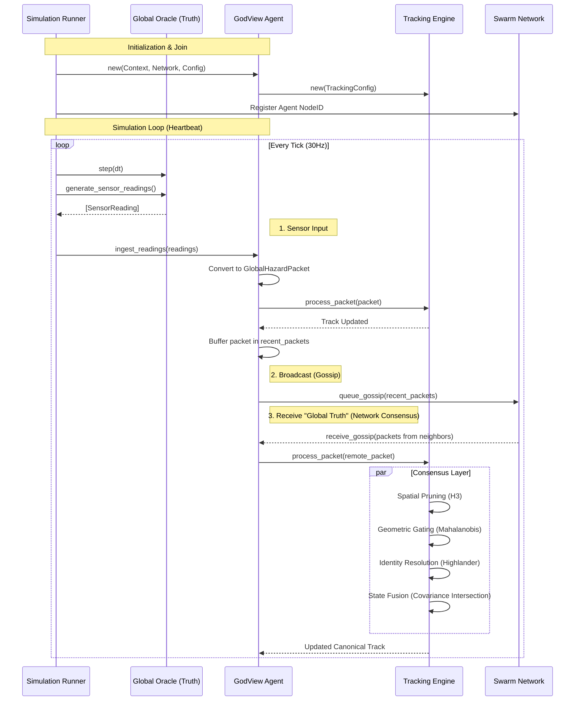
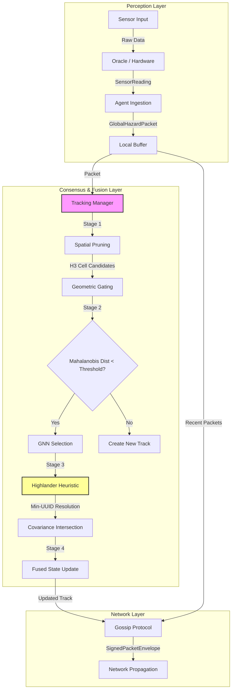

# GodView Architectural Analysis

## 1. Sequence Diagram: Agent Join, Broadcast & Global Truth

This diagram illustrates the lifecycle of a single Agent within the GodView swarm simulation.

## 2. Data Flow Map: Sensor to Network

The data flows through a strict pipeline designed for deterministic consistency.

## 3. The Core & Ownership Model

### The Heartbeat: `godview_core::agent_runtime::GodViewAgent`

The specific module acting as the "heartbeat" of the system is the **`GodViewAgent`** struct (specifically its `tick()` method) located in `godview_core/src/agent_runtime.rs`.

While `godview_sim::runner` drives the *simulation* time, the `GodViewAgent` orchestrates the internal logic of the autonomous unit. 

**Core Responsibilities:**
1.  **Orchestration**: It holds the four mathematical engines (`Time`, `Space`, `Trust`, `Tracking`) and coordinates data flow between them.
2.  **Tick Execution**: Its `tick()` method drives the `TimeEngine` prediction step and `TrackManager` housekeeping (aging tracks) independently of network events.

### Ownership Model & Safety

The system uses a **Single Ownership / Vertical Isolation** model to ensure safety, particularly for Deterministic Simulation Testing (DST).

*   **Vertical Ownership**: 
    *   The `GodViewAgent` strictly **owns** its engines (`TimeEngine`, `SpatialEngine`, `TrackManager`) by value.
    *   It does **not** share these engines behind `Arc<Mutex<...>>` or other interior mutability patterns.
    *   This guarantees that during a `tick()` or `process_packet()`, the agent has exclusive, synchronous mutable access to its entire state (`&mut self`).
    
*   **Environmental Isolation**:
    *   External dependencies (Time, Network, Randomness) are abstracted via the `GodViewContext` and `NetworkTransport` traits.
    *   The Agent holds these as `Arc<Context>`, effectively verifying that it mostly treats the environment as **read-only** or **message-passing only**, preventing side-effect leakage that would break determinism.

*   **Safety Guarantee**:
    *   **Deadlock Freedom**: Since the Agent doesn't internally lock distinct resources, it is immune to deadlocks within its own logic.
    *   **Deterministic Replay**: The ownership model ensures that given the same sequence of inputs (ticks + packets), the internal state transitions are pure functions, essential for the "God View" global truth verification.
