# GodView Core - Architecture & Implementation Summary

**Date:** 2025-12-22  
**Version:** 0.3.0  
**Status:** ✅ All tests passing (22/22)

---

## Architecture Overview

```mermaid
graph TB
    subgraph "godview_core"
        TIME["⏰ Time Engine<br/>godview_time.rs<br/><i>AS-EKF</i>"]
        SPACE["🌍 Space Engine<br/>godview_space.rs<br/><i>H3 + 3D Grid</i>"]
        TRUST["🔐 Trust Engine<br/>godview_trust.rs<br/><i>CapBAC + Ed25519</i>"]
        TRACK["🎯 Tracking Engine<br/>godview_tracking.rs<br/><i>GNN + CI + Highlander</i>"]
    end
    
    ZENOH["Zenoh Mesh"] --> TRUST
    TRUST --> TRACK
    TRACK --> TIME
    TRACK --> SPACE
```



| Problem | Engine | Solution |
|:--|:--|:--|
| **Time Travel** | Time | Augmented State EKF for out-of-sequence measurements |
| **Pancake World** | Space | H3 hexagonal sharding + 3D grid spatial index |
| **Sybil Attack** | Trust | CapBAC with Biscuit tokens + Ed25519 signatures |
| **Duplicate Ghost** | Tracking | GNN + Covariance Intersection + Highlander CRDT |

---

## Module Summary

### 1. Time Engine (`godview_time.rs`) ✅ Fixed

- **Purpose:** Handle out-of-sequence measurements via Augmented State EKF
- **Key Fix:** Covariance matrix now properly shifted with state in `augment_state()`
- **Complexity:** `predict()` O((D·N)³), `update_oosm()` O(S²)

### 2. Space Engine (`godview_space.rs`) ✅ Fixed

- **Purpose:** Hierarchical spatial indexing (H3 global + 3D grid local)
- **Key Fixes:**
  - 3D grid-based spatial index replaces linear scan: O(k³) vs O(N)
  - Resolution-aware edge length calculation via `H3_EDGE_LENGTH_M` lookup

### 3. Trust Engine (`godview_trust.rs`) ✅ Fixed

- **Purpose:** Cryptographic provenance and access control
- **Key Fix:** Revocation check now O(1) using `HashSet<[u8;32]>`

### 4. Tracking Engine (`godview_tracking.rs`) ⭐ NEW

- **Purpose:** Distributed data association to eliminate duplicate ghosts
- **4-Stage Pipeline:** Spatial pruning → Geometric gating → Identity resolution → State fusion
- **Key Algorithms:** Mahalanobis gating, Covariance Intersection, Highlander CRDT
- **Key Fix:** Track rekeying when canonical_id changes during Highlander merge

---

## Test Results

```
$ cargo test
running 22 tests
test result: ok. 22 passed; 0 failed
```

---

## All Bugs Fixed

| Engine | Issue | Status |
|:--|:--|:--|
| Time | Covariance not shifted | ✅ Fixed |
| Space | Linear scan O(N) | ✅ Fixed (3D grid) |
| Space | Hardcoded 66m hex | ✅ Fixed (lookup table) |
| Trust | O(N) revocation | ✅ Fixed (HashSet) |
| Tracking | age_tracks off-by-one | ✅ Fixed |
| Tracking | Missing track rekey | ✅ Fixed |

---

## Dependencies

```toml
nalgebra = { version = "0.33", features = ["serde-serialize"] }
h3o = { version = "0.9", features = ["geo", "serde"] }
biscuit-auth = "4.0"
ed25519-dalek = { version = "2.1", features = ["serde"] }
serde = { version = "1.0", features = ["derive"] }
uuid = { version = "1.7", features = ["v4", "serde"] }
thiserror = "1.0"
```

---

## Next Steps

1. **Integration:** Connect TrackManager to Zenoh subscriber
2. **Benchmarks:** Performance testing with 1000+ simultaneous tracks
3. **Visualization:** Export track data for debugging
