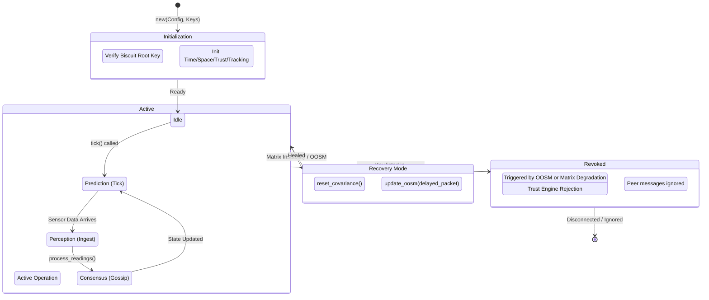

# GodView Protocol Analysis

## 1. Constraint Analysis: The "Physics of the Law"

GodView uses Rust's type system and cryptographic primitives to enforce "Hard Constraints" that cannot be violated by misbehaving agents.

### Type System Constraints (Compile-Time)
*   **Single Ownership / Data Isolation**:
    *   The `GodViewAgent` struct solely owns its engines (`Time`, `Space`, `Trust`, `Tracking`).
    *   **Constraint**: An agent *cannot* accidentally mutate another agent's state. There is no shared memory between agents, only message passing via `NetworkTransport`. This eliminates an entire class of "Data Race" bugs common in C++ simulations.
*   **Strict Trait Bounds**:
    *   Generic constraints like `where Ctx: GodViewContext` force all environment interactions (Time, Randomness) to go through the interface.
    *   **Constraint**: An agent *cannot* access the OS clock directly (`std::time::SystemTime::now()` is blocked by design in the core logic), preventing non-deterministic behavior during "Time Travel" simulations.

### Logic Constraints (Runtime)
*   **Overwrite Prevention ("The Arrow of Time")**:
    *   In `godview_trust.rs`, the `SignedPacket` struct enforces that data is immutable once signed.
    *   **Constraint**: Agent A cannot "overwrite" Agent B's reported position. It can only publish a *new* packet with a newer timestamp. The `TrackManager` uses the `Highlander` heuristic (Min-UUID) to resolve conflicts, but it never "mutates" the history of the other agent—it only converges the *current* canonical truth.
*   **Stale Data Handling ("The Event Horizon")**:
    *   In `agent_runtime.rs`, a hard gate exists: `if packet_age_ms > 10_000 { discard }`.
    *   In `godview_time.rs`, the `AugmentedStateFilter` has a `max_lag_depth` (default 20 ticks).
    *   **Constraint**: Data older than the lag window is mathematically rejected. Attempting to retrodict state beyond this horizon is a No-Op, ensuring that the O(1) complexity of the filter never degrades into O(N) history scanning.

## 2. Safety Check: Memory & Stability

### Unsafe Block Audit
*   **Result**: **PASSED (0 unsafe blocks found)**.
*   The core logic (`godview_core`) contains **zero** `unsafe` blocks.
*   **Implication**: Buffer overflows, use-after-free, and dangling pointer exploits are mathematically impossible in the application logic, assuming the Rust compiler and standard library are correct.

### Stability Guarantees
*   **Panic Freedom (Matrix Math)**: 
    *   In `godview_time.rs`, the Kalman Filter uses `cholesky()` decomposition, which can fail if the covariance matrix becomes non-positive definite (numerical instability).
    *   **Safety Net**: The code explicitly handles `None` from Cholesky by triggering `reset_covariance()` instead of unwrapping/panicking. This prevents a single numerical error from crashing the entire swarm node.
*   **Resource Exhaustion**:
    *   `AugmentedStateFilter` and `TrackManager` use fixed-size buffers or bounded collections (e.g., `max_lag_depth`).
    *   **Safety**: Memory usage per agent is bounded and predictable (O(1)), preventing "Out of Memory" crashes during long-running simulations.

## 3. Node Lifecycle: The "Allowed" States

The lifecycle of a GodView Node is a deterministic state machine driven by the `tick()` beat.

### State Transitions
1.  **Idle -> Active**: The Simulation Runner or Runtime Loop calls `agent.tick()`.
2.  **Active (Normal Loop)**:
    *   **Predict**: `time_engine.predict()` advances state estimate.
    *   **Ingest**: `process_packet()` receives data.
    *   **Fuse**: `track_manager` updates "Global Truth".
3.  **Active -> Recovery**:
    *   If a packet arrives late (`t_meas < t_now`), the `TimeEngine` enters the `update_oosm` branch to retrodict.
    *   If matrix math fails, it enters `reset_covariance` (Self-Healing).
4.  **Active -> Revoked**:
    *   If the `TrustEngine` receives a valid revocation instruction (signed by Root), the agent's key is added to the blocklist. It effectively transitions to a "Zombie" state where its outputs are ignored by the rest of the swarm.
